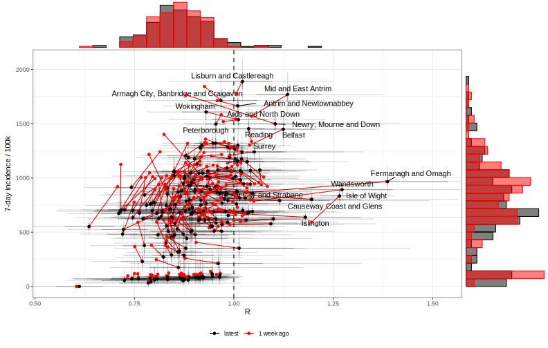
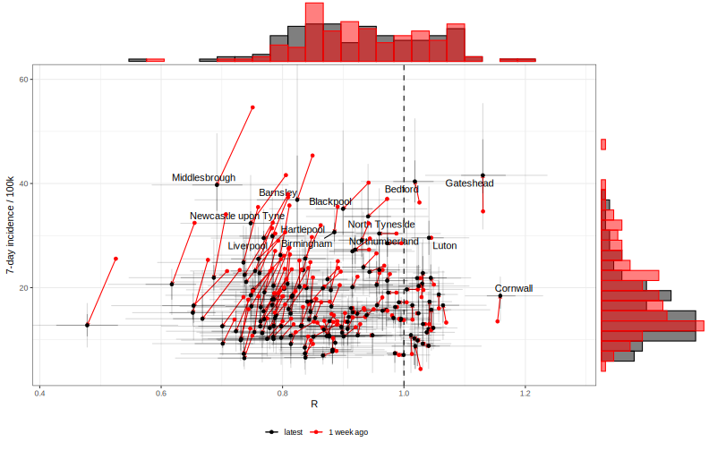
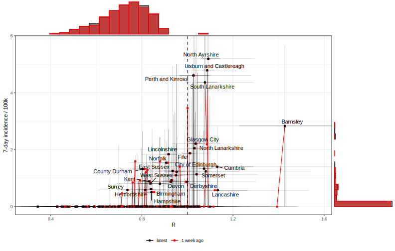
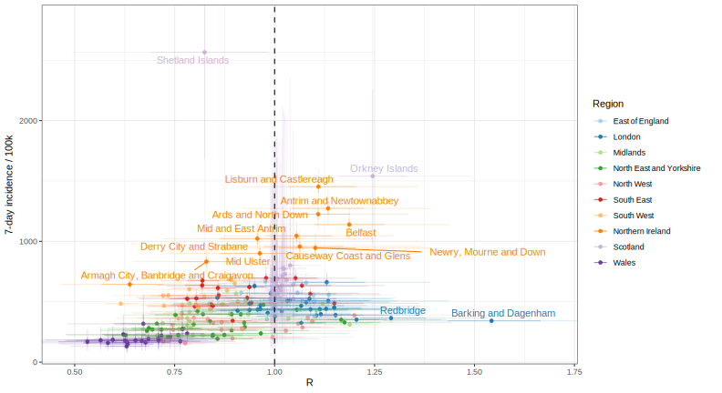
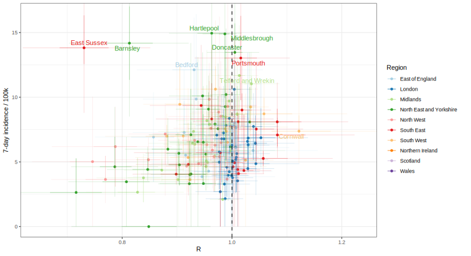
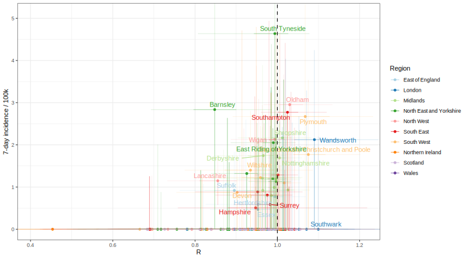
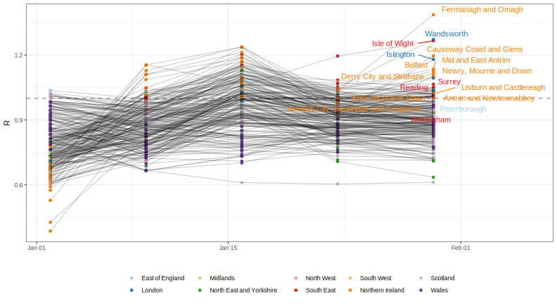
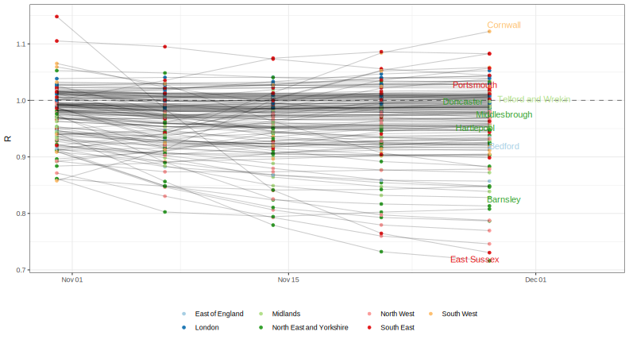
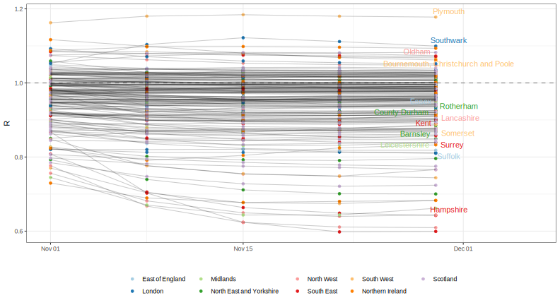
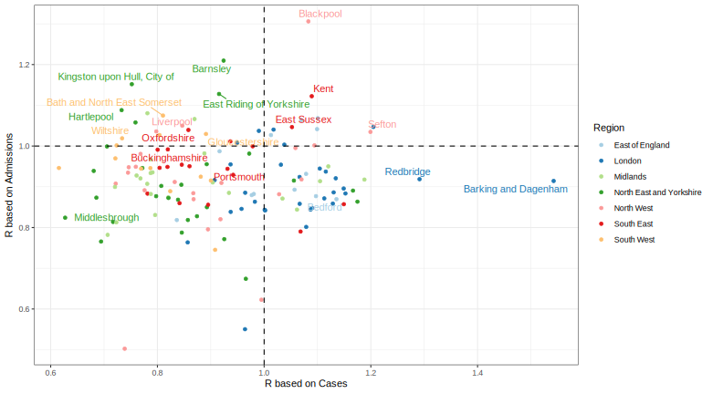

<!-- README.md is generated from README.Rmd. Please edit that file -->

All plots generated using data and estimates from [Epiforecasts UK
Covid](https://epiforecasts.io/covid/posts/national/united-kingdom/)
separately for test positive cases, hospital admisssions, and mortality.

# R vs incidence - week-on-week change

## Cases

## Admissions (England only)

## Deaths

# R vs incidence - by region

## Cases

## Admissions (England only)

## Deaths

# Proportion of UTLAs likely to have R>1

## Cases

## Admissions (England only)

## Deaths

# Recent reproduction numbers

## Cases

## Admissions (England only)

## Deaths

# Cases vs. admissions

