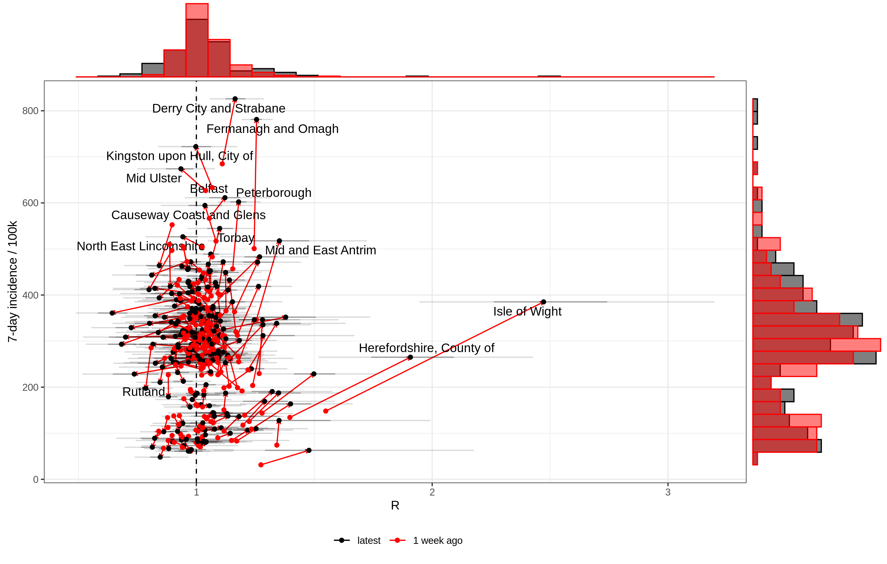
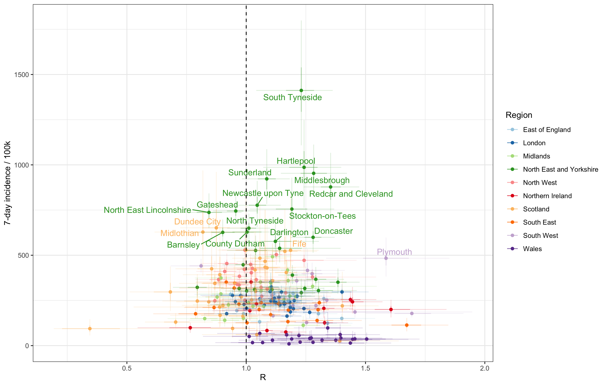
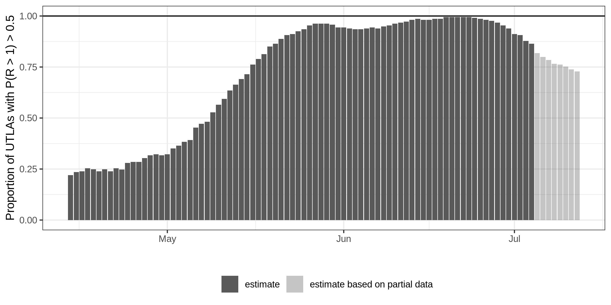
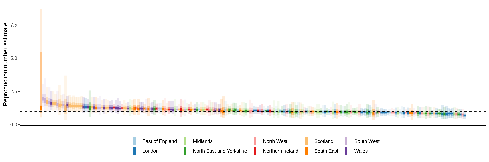

<!-- README.md is generated from README.Rmd. Please edit that file -->

All plots generated using data from [Epiforecasts UK
Covid](https://epiforecasts.io/covid/posts/national/united-kingdom/).

# R vs incidence - week-on-week change

# R vs incidence - by region

# Proportion of UTLAs likely to have R>1

# Distribution of reproduction numbers by region

# Recent reproduction numbers

